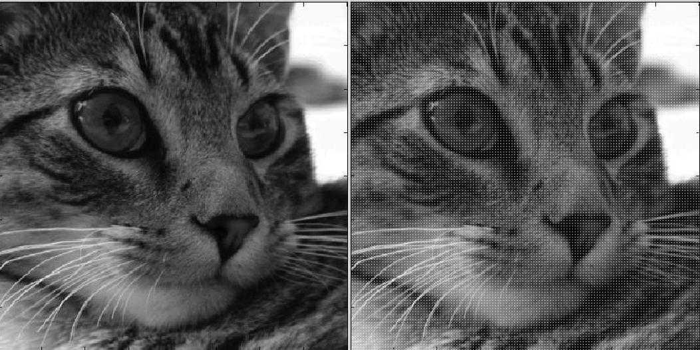
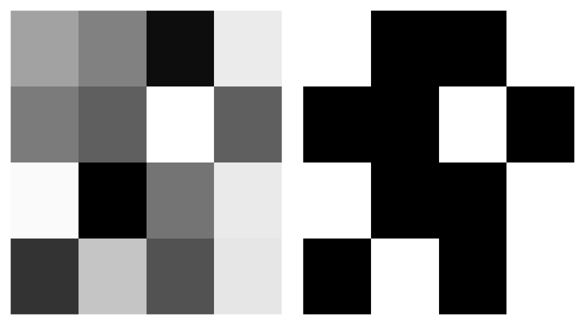

Block Truncation Coding (BTC) is a lossy compression algorithm. Unlike [Huffman Coding](Huffman.html), BTC loses a little bit of information when you apply it. But when compressing things like images, the loss is often either not noticeable, or at least doesn't interfere with the interpretation of the image. If the original image was of a European Swallow, we can tell the reconstructed image is a European Swallow and not say, an African Swallow. BTC relies on the idea that if two distributions have the same parameters, they're most likely similar. Or...similar enough.


A 4x4 pixel image that has 8 bits (0-255) per pixel will need to send 128 bits of information to send over that image. But we can improve on that if we're willing to sacrifice a little.

You can see here a picture of a cat on the left and the BTC compressed version on the right.
<br/>
<br/>
<center>

</center>
<br/>

## Encoding a Block
To use BTC, first we split our image into 4x4 blocks. Then, we encode each 16 pixel block individually. Each block is pretty small compared to the 512x512 image. First, we calculate the mean and the standard deviation of the pixel values (for this example, we'll use a grayscale image).

$$ \bar{I} = \frac{1}{16}\sum\limits_{i = 0}^{15} I(i)$$
$$\bar{\sigma} = \sqrt{\frac{1}{16}\sum\limits_{i = 0}^{15}(I(i) - \bar{I})^2}$$
We then decide how *precisely* we want to send our mean and standard deviation. Usually 8 bits for each will do the trick, but we can even use as few as 6 or 4. So far, we have 8 + 8 = 16 bits of information for this image.

Next, we also send over a binary 4x4 block with 1's if the original pixel is greater than or equal to the mean, and a 0 if it was less than the mean.

$$b(i)=\left\{
                \begin{array}{ll}
                  1; \text{    if I(i)} \geq \bar{I}\\
                  0; \text{    otherwise.}
                \end{array}
              \right.$$

We need 16 bits (1 for each pixel in the image) to transmit this binary block, so now we're up to 32 bits to send out this image. Compared to 128 bits to send the original image, that's nothing to sneeze at.

<br/>
<center>

</center>
<br/>

For example, to encode this grayscale block, we would send the mean (~150) the standard deviation (~74), and the binary matrix that tells us whether each pixel is higher or lower than the mean.


## Decoding a Block
Once we do this for each 4x4 block in the image and send it where it needs to go, the computer on the other end will need to *decompress* the image in order to view it.

To do this, first we need to count up the number of 1's and 0's in that binary matrix we sent over. This gives us more information about the distribution of our original pixel values. For example, these two data sets have the same mean and (approximately) standard deviation. But if we know how many points are above and below the mean, we can easily tell them apart. Dataset a has 5 points above the mean, and dataset b has only 2. That tells us some information about how extreme the datapoints in a and b are. Since b only has 2 points above the mean but has the same standard deviation (approximately) as a, those two points are probably pretty big (and they are)!

```{r spriteLite, include=FALSE}
a <- c(1,1,1,1,1,5,5,5,5,5)
b <- c(2,2,2,2,2,2,2,6,2,8)

sum(a)
sum(b)
sd(a)
sd(b)
```
```{r spriteLite2, echo = FALSE}
hist(a, xlim = c(1,8))
hist(b, xlim = c(1,8))
```
<br/>
We will let Q be the number of 1's in the binary matrix, and P be the number of 0's. We'll then create a new image block **J** where:

$$J(i)=\left\{
                \begin{array}{ll}
                  \bar{I} + \frac{\bar{\sigma}}{\sqrt{\frac{Q}{P}}}; \text{ if b(i) = 1} \\
                  \bar{I} - \bar{\sigma} * \sqrt{\frac{Q}{P}}; \text{    if b(i) = 0}
                \end{array}
              \right.$$
Using $\bar{I} + \frac{\bar{\sigma}}{\sqrt{\frac{Q}{P}}}$ and $\bar{I} - \bar{\sigma} * \sqrt{\frac{Q}{P}}$ forces the mean and standard deviation of our new block to be the same as our original one. So even though you can see that they're not exactly the same, they at least share 3 important properties: mean, standard deviation, and location of high and low pixels.

For the sample block we looked at in the last section (left), we can see the new encoded block (right).

<br/>
<center>

</center>
<br/>

## In R
If you want to do some quick (well, it does take a long time) BTC, here's an approximate example in R using our adorable cat photo!
``` {r BTCex, eval = FALSE}
library(imager)
#---functions---------------------------
btcENCODE <- function(im){
  meanI <- mean(im)
  sdI <- sd(im)
  bin <- im > meanI
  
  return(list(mean = meanI, sd = sdI, bin = bin))
}
btcDECODE <- function(m,s,bi){
  Q <- sum(bi)
  P <- 16 - Q
  A <- sqrt(Q/P)
  a <- m + s/A
  b <- m - s*A
  decod <- bi
  decod[decod == 1] <- a
  decod[decod == 0] <- b
  return(decod)
  
}
#---load--------------------------------

cat <- load.image("/images/BTC/cat.png")
plot(cat, axes = F)

#one Block example
t <- btcENCODE(catMat2[1:4,1:4])
t2 <- btcDECODE(round(t$mean),(round(t$sd), t$bin)

#example transformation
plot(as.cimg(catMat2[1:4,1:4]), axes = F)
plot(as.cimg(t2), axes = F)

#---whole Cat BTC------------------------
catBTC <- cat
iter <- seq(1,508,4)
for (i in iter){
  for (j in iter){
    print(paste0(i,",",j))
    en <- btcENCODE(cat[i:i+4, j:j+4])
    catBTC[i:i+4, j:j+4] <- btcDECODE(en$mean, en$sd, en$bin)
  }
}

plot(as.cimg(catBTC), axes = F)

par(mfrow = c(1,2), mar = c(0,0,0,0))
plot(as.cimg(cat), axes = F)
plot(as.cimg(catBTC), axes = F)
```
## Conclusion
Depending on the number of bits you use to send the mean and standard deviation, BTC can save a LOT of space. And often, the image quality is not noticeably (or annoyingly) different. We sacrifice a little quality, but we gain a *LOT* of memory. 

Sorry, NOT SORRY for the loss.

