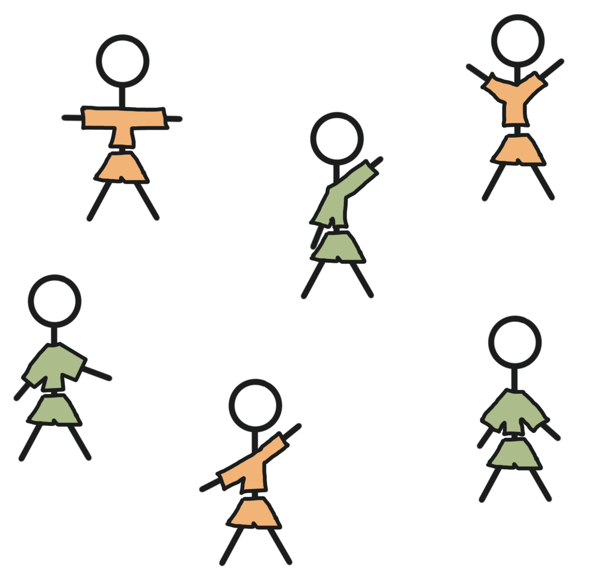
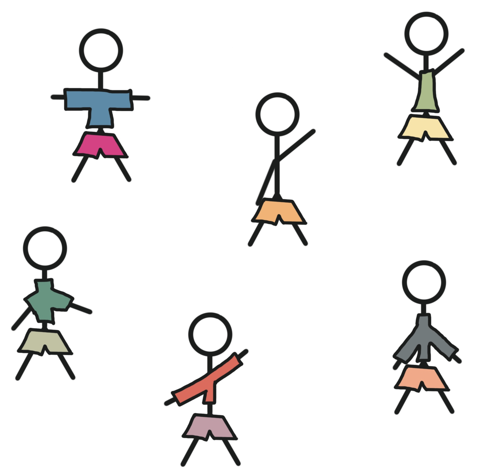
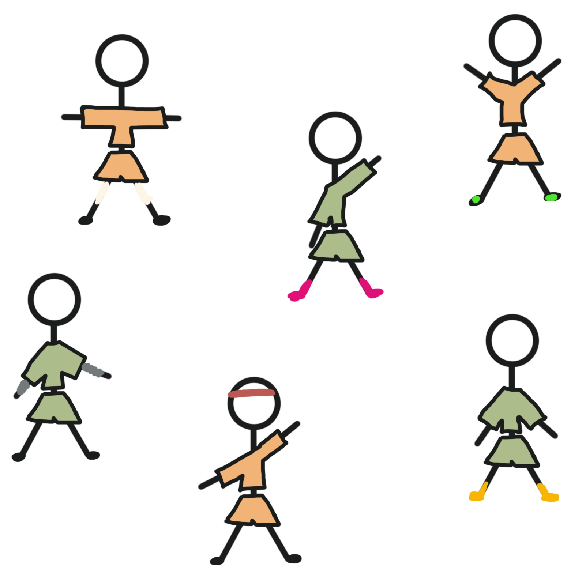
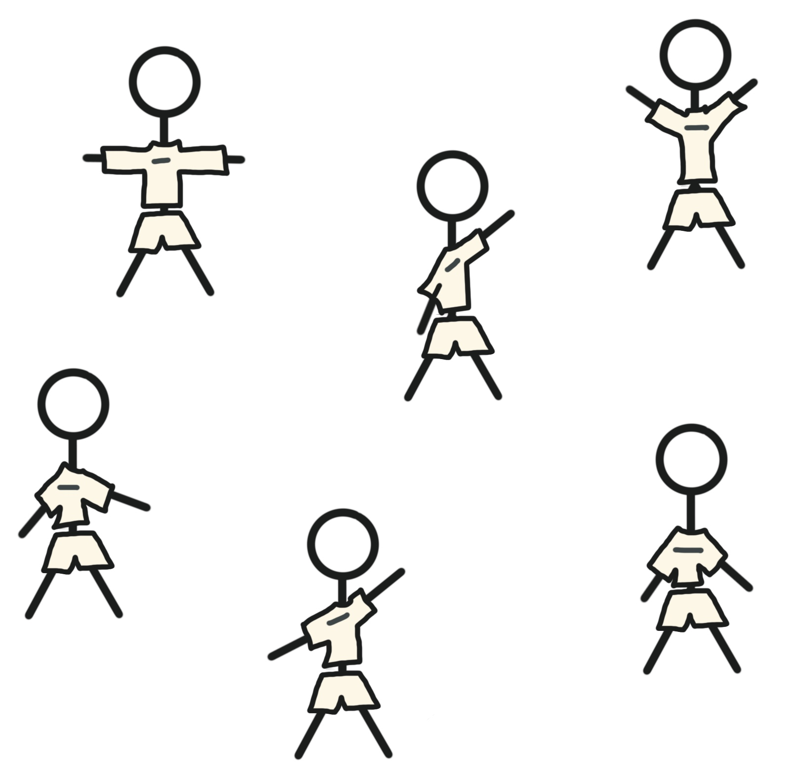
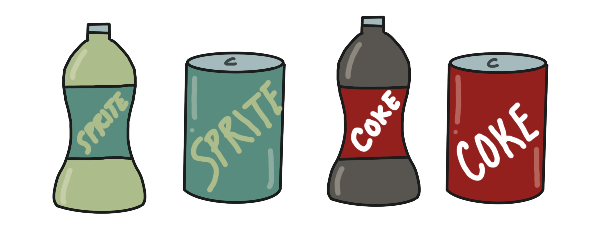
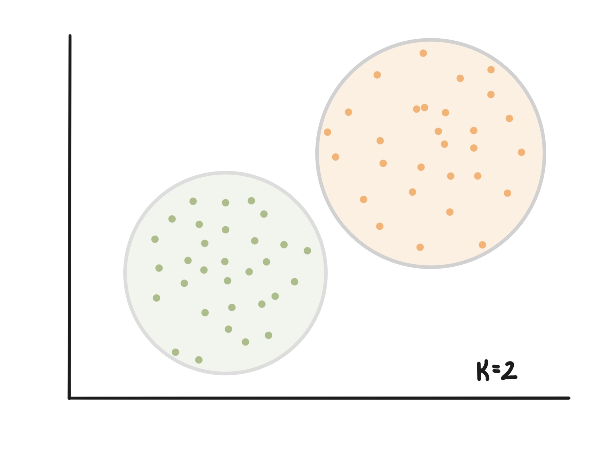
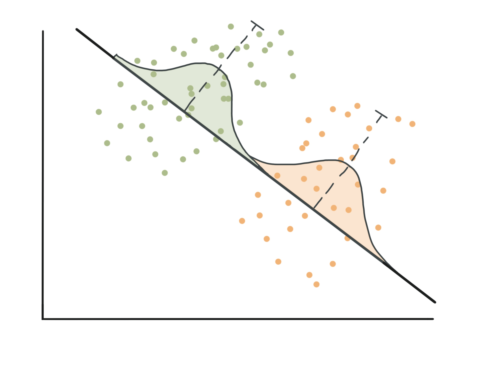
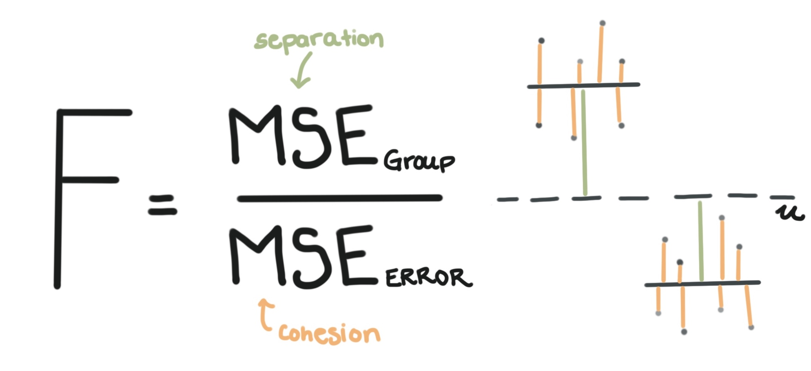

 

If you want to create groups of things, you will probably think about two things: **Cohesion and Separation**. It’s hard to say what makes a “good” set of groups, but cohesion and separation can help us figure it out. Let’s imagine you’re at a soccer game. 

### Cohesion
Your seats are far away from the actual players, but you still have a good view of the game. We rely on cohesion and separation in order to keep track of the players. **Cohesion** means that members of a group are similar. A team with cohesive uniforms will all look similar on the field. In the image below, the uniforms of our two teams are extremely cohesive which makes it easy to tell who is on what team.

Imagine a game where players wear whatever they want. Most of the time it would be difficult to tell who was on what team. 

Those uniforms would NOT be cohesive. Teammates would not look like each other. Real uniforms are incredibly cohesive. They are the same color and they largely look the same-- even if players have some choice about undershirts or accessories. 

### Separation
Cohesion is incredibly important when creating well-defined group. So is **separation**. Imagine watching a soccer game where both teams’ uniforms were eerily similar. The cohesion within each team is high, everyone looks very similar to their teammates. But they also look a lot like the other team.

Well defined groups need to be different--or separate--from other groups. In a game where both teams have the same uniforms, it would be nearly impossible to keep track of the teams. Each team has high cohesion, but we need both cohesion and separation in order to have well-defined groups. We saw that when cohesion was low and everyone wore whatever they wanted, it was hard to figure out who was on which team. The same thing happened when separation was low and all the players wore the same thing. To make sure separation is high, soccer teams often have different versions of their uniforms and purposefully wear colors that are different (or separate) from the team they’re playing.

### Applications
When teams wear uniforms that are similar to each other, and very different from the team they’re playing we have strong cohesion and separation which makes them well-defined groups.

Brands often do this too. Whenever you see a Coke, the branding often makes it look like other Cokes. But Cokes look different from Sprites which look different from Dr. Peppers. The cohesion helps you tell that the sprite that you have in a can is the same as the Sprite you see next to it in a 2-liter bottle. The separation helps you tell that the bottle you quickly grabbed near the register is Coke, and not Sprite.

Cohesion and Separation are two intertwined ideas that help us understand what well-defined and useful groups tend to look like. In **clustering** (one main type of Unsupervised Machine Learning), the fit of clusters is often measured by both cohesion and separation. The silhouette score is used to provide a quantifiable measure of the cohesion and separation of clusters. When cohesion and separation are both high, we think our clusters are a good fit to the data.

Other techniques like **Linear Discriminant Analysis** explicitly choose linear combinations of features that maximize cohesion and separation of groups on that combination.

Even the **Analysis of Variance** (ANOVA) relies on the ideas of cohesion and separation to create test statistics that tell us if groups are “statistically significantly different”. F-statistics include both separation (the numerator) and cohesion (the denominator). Technically, the denominator is measuring variation which is the inverse of cohesion. When cohesion is high, variation is low.  When cohesion AND separation are both high, we get very large F-statistics  (and therefore small p-values) because our groups are well-defined and are “statistically significantly different”.

Cohesion and Separation are important concepts in Statistics, and understanding them can help you grasp a lot of the fundamentals. Luckily, learning about them is as easy as imagining a soccer game.

