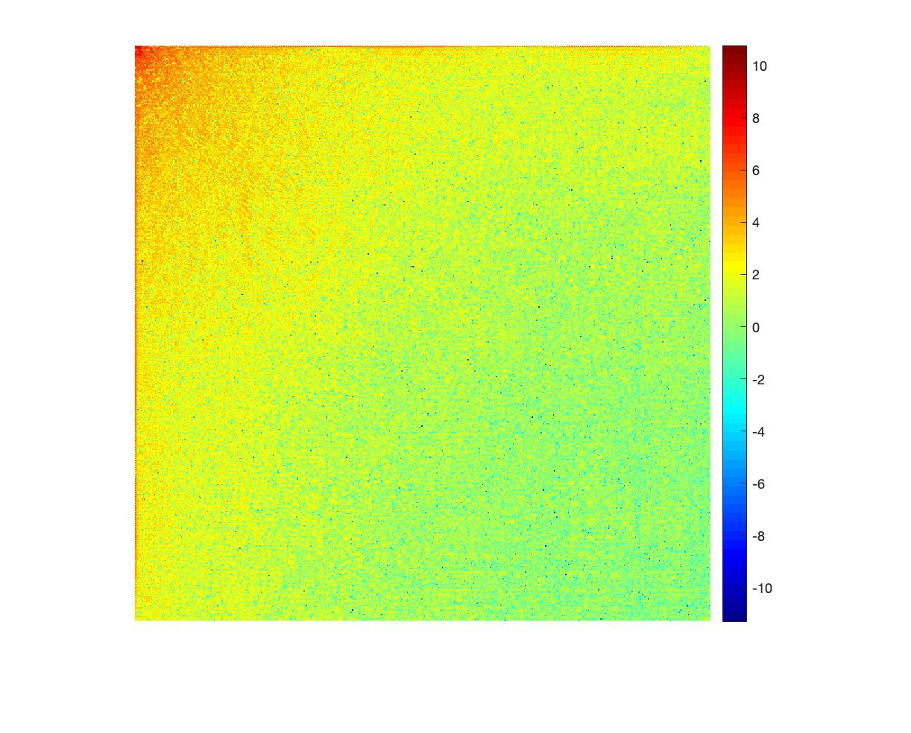

The Discrete Cosine Transform (DCT) relies on the idea that any 2D image can be represented by the sum of *at most* $N^2$ cosine waves. DCT takes an image from a traditional spatial representation and transforms it into the frequency domain.

We use the formula

$$\tilde{I}(u,v) = \frac{4C(u)C(v)}{N^2}\sum\limits_{ i = 0}^{N-1}\sum\limits_{j = 0}^{N-1} I(i,j) cos(\frac{(2i + 1)u\pi}{2N})cos(\frac{(2j + 1)v\pi}{2N})$$

where

$$C(u) = \left\{
                \begin{array}{ll}
                  \frac{1}{\sqrt{2}}, u = 0 \\
                 1, \text{ otherwise}
                \end{array}
              \right.$$
              
              
To inverse this process we use a very similar formula

$$I(i,j) = \sum\limits_{ u = 0}^{N-1}\sum\limits_{v = 0}^{N-1}C(u)C(v) cos(\frac{(2i + 1)u\pi}{2N})cos(\frac{(2j + 1)v\pi}{2N})$$

## Actual Compression
So far, we've just changed our image from the spatial domain to the frequency domain. But doing this particular transformation allows us a very principled way of getting rid of high frequencies that humans won't notice anyway. When you plot the frequencies as a matrix, the higher, more important frequencies will often be in the top left corner of the matrix. If we keep only the most important frequencies (the exact cutoff is up to you), we can greatly reduce the amount of information we need to store or send an image.

 

 
 

 

When we recreate the image using only the frequencies we kept we will lose some information (it's lossy), but because of the way we chose which frequencies to keep, it should be mostly information thats unnoticible in most contexts.

## Conclusion
DCT is great, it was used in jpegs and I don't have much more to say about it at the moment.

