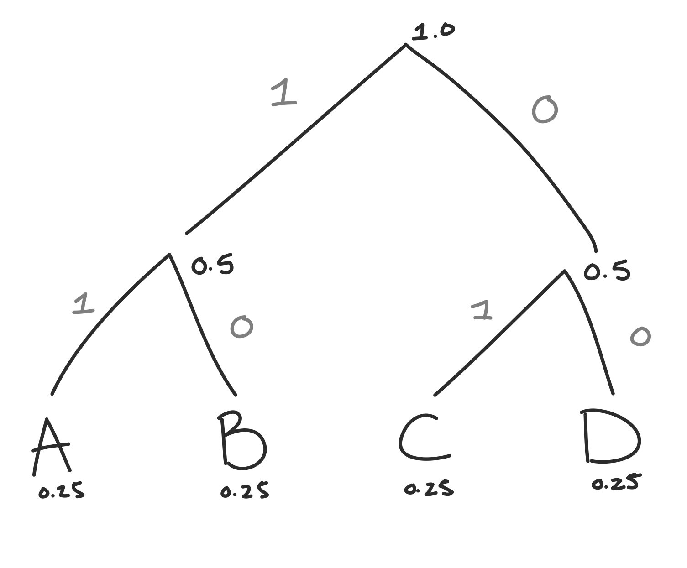

Huffman Coding is a method of *lossless* compression. Lossless compression is valuable because it can reduce the amount of information (or in your computer, memory) needed to communicate the *exact same* message. That means that the process is perfectly invertible. Lossy compression on the otherhand will lose information. The message that is reconstructed will be slightly different.

Huffman coding creates a binary tree that is [guarenteed](http://www.cs.utoronto.ca/~brudno/csc373w09/huffman.pdf) to generate the most efficient way to compress your message.

 

 

Let's imagine you're helping a friend cheat on a multiple choice exam (note: this blog does *not* condone cheating IRL). On this particular test, there's 4 multiple choice answers, A,B,C and D. You've decided to communicate the answers using coughs and taps. For simplicity, we'll represent things as bits: coughs as 0, and taps as 1.

At first, you create this code:
 
A: 11
 
B: 10
 
C: 01
 
D: 00

Which means that if the asnwer was A, you'd tap twice. If the answer was C, you'd tap then cough.

This method is relatively efficient, for each answer you communicate, you need to do 2 actions (coughs or taps) or use 2 bits (0's and 1's).

In fact, if the answers A, B, C, and D have equal probabilities (0.25) of occuring, that's the best you can do. Let's demonstrate using Huffman Coding.

## How to create a Huffman Code
### A simple Huffman Code

First, we'll put the items in order of decending probabilities (smallest probs to the right).

Then, there are 3 repeatable steps to creating the binary tree that determines your Huffman Code:

1. find the two items with the lowest probabilities pi and pj
2. connect the two items
3. add their probabilities together, and treat them as a new node with probability pi + pj

**note:** if there's a tie, where it's not clear which two probabilities to pick, like here where we have all probabilities equal to 0.25, take the two rightmost items, it'll make a cleaner tree.

We'll keep doing steps 1-3 until we've covered all the items we have.

 

 

Since all our probabilities are the same, we'll first combine the two rightmost ones: C and D.

 

 

Now we have three probabilities to consider: 0.25, 0.25 and 0.5. We'll combine the two lowest: A and B. 

 

 

Now there's only two left, so we'll combine our two 0.5s to create the root node that has probability 1.

 

 

To create our code from this binary tree, we'll start at the root and use a 0 every time we take the right path, and 1 every time we take the left.

 

 

To get the code for each answer, we'll just follow the tree down. For example to get to A we go left, left so the code for A will be 11 (or tap tap).

What a coincidence!! We just created the same code we originally used. Since Huffman Coding guarentees that the most efficient code, it looks like in this case we can't improve the efficiency of our coughs and taps.

### A more useful Huffman Code
Let's try again, this time incorperating the information that your teacher, whose name is **B**rian, uses the answer B 50% of the time, A 10% of the time, C 20% of the time, and D 20% of the time. Now let's create a new Huffman Code. 

 

 

This time the binary codes for A,B,C and D are:

 
A: 000
 
B: 1
 
C: 01
 
D: 001
 

Now our codes are looking different. The codes are also different lengths. B is just 1, whereas A is 000. Huffman Coding takes advantage of the fact that B occurs the most, whereas A occurs the least. The way we've coded our letters, the ones that occur the most have the shortest codes. This will lead to a lower number of average bits to transcribe the answers to your friend's test.

Previously, our code had an average of 2 bits per letter. We got that using this formula:

$$\sum\limits_{k = 1}^K p(k) log_2(k)$$

Where $log_2(k)$ is the number of bits needed to code each letter. 

In our new encoding we get $0.5(1) + 0.2(2) + 0.2(3) + 0.1(3) = 1.8$. Before we needed an average of 2 bits to relay the test answers, but now that we've taken advantage of the fact that Brian likes B's and not A's we've reduced the average number of bits down to 1.8. While that's not a huge improvement, if your friend's test is 50 questions long, it saves you 10 coughs/taps, which certainly will make things a bit easier!

## Conclusion

Huffman Coding can help you cheat more efficiently, but it can also help you do more...ethical...things like encode images or sounds more efficiently. It's used in some famous image compression algorithms that you might be familiar with like JPEG and PNG, file formats that I used here in this very blog!

While using Huffman coding doesn't always produce a *huge* reduction in the amount of bits needed to communicate a message, it's powerful because it's lossless. Even though we reduce the average number of bits needed, we don't lose *any* of our original message. This is important when we need to make sure that the message we send is exactly the one that is received.

Happy Compressing!

