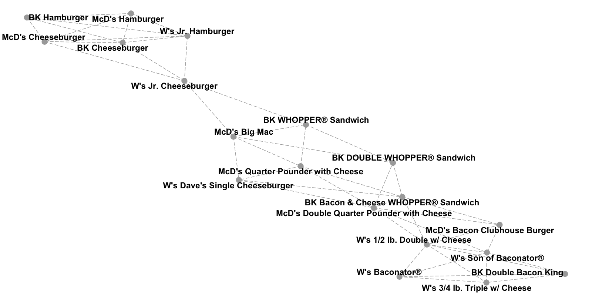
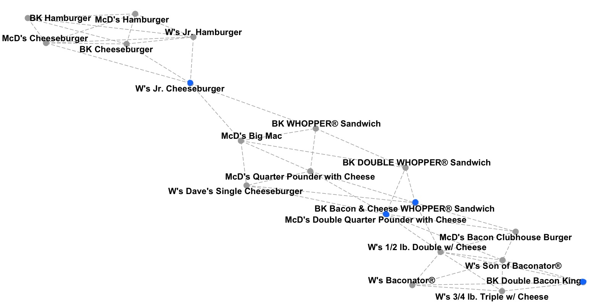
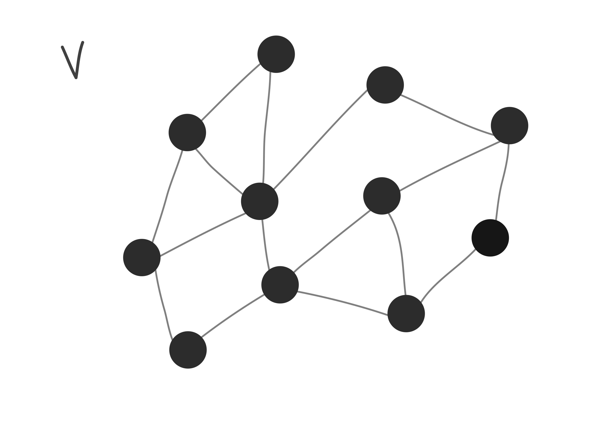
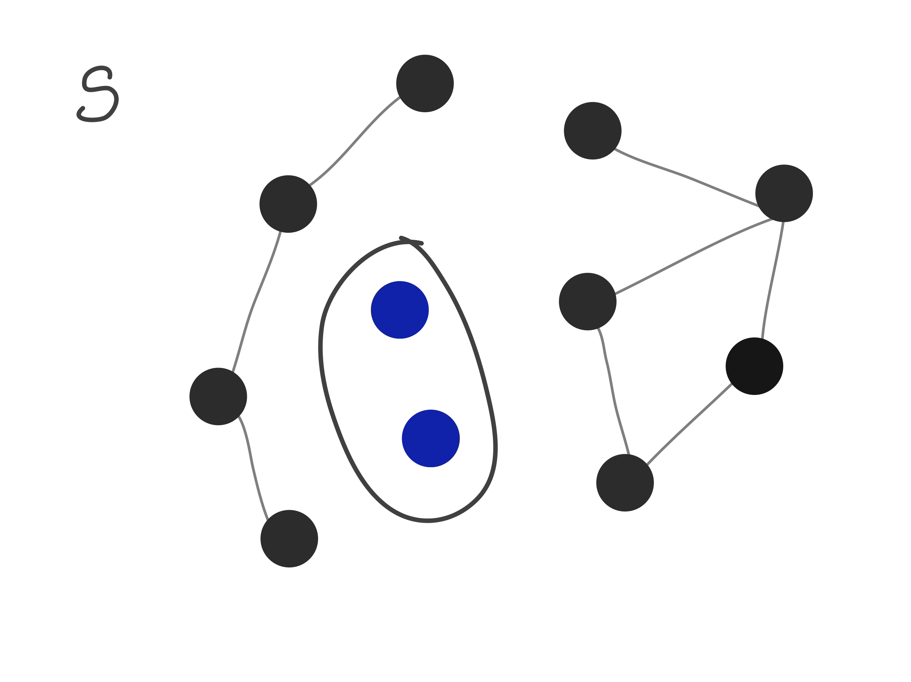
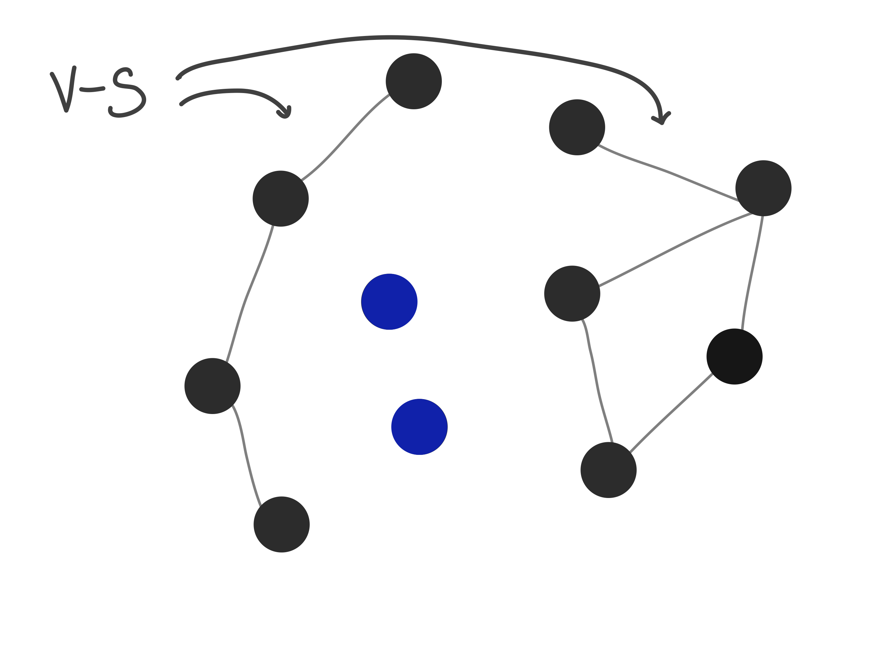
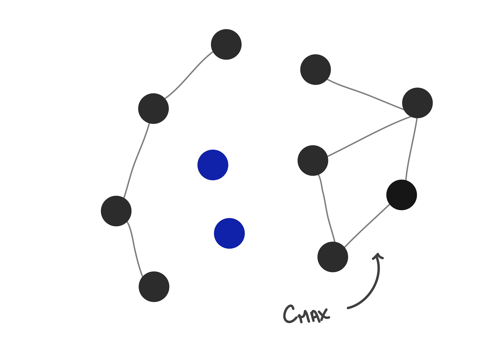
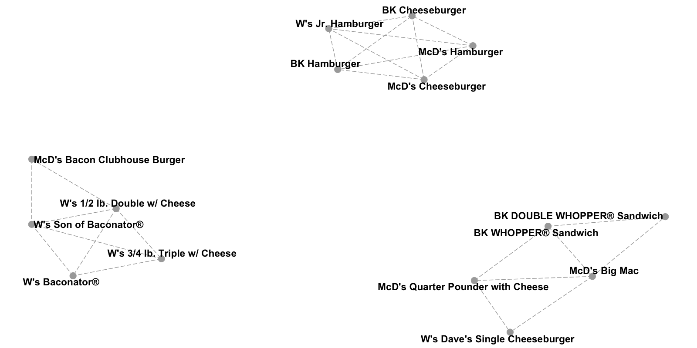
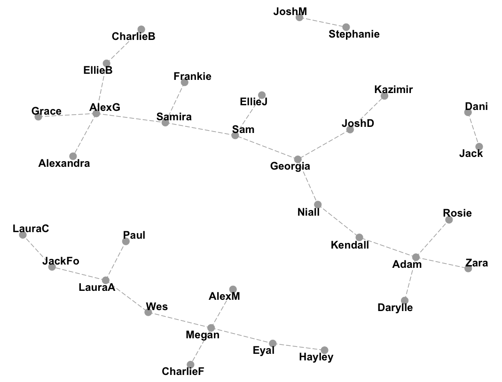

</br>

Node-Based Resilience (NBR) Clustering is a lesser known (for now!) method of clustering that uses graph theory to put similar objects into clusters. But you don't need a TON of graph theory to follow along, I promise.

## How

The steps for NBR Clustering are relatively simple:

1. Create a Graph
2. Choose an Attack Set
3. Remove Attack Set

</br>

### Creating a Graph
A **graph** is a data structure that represents a set of objects, and how they are connected. We could create a graph to represent all the people matched on Tinder. But we can also create graphs that represent data points and their similarities to each other. To use NBR clustering in a similar way to other methods like k-means or hierarchical clustering, we need to create a **k-nearest neighbors (kNN) graph**. First, we create a **node/vertex** for each data point. Then, we need to create the **connections/edges** between them. For any given k, we create a conncection/edge between each node to the k nearest neighboring nodes. Below, you can see a kNN graph from a dataset of nutritional information on fast food hamburgers.

</br>
<center>

</center>
</br>


This produces a graph where data points are only connected to similar nodes. Depending on how large k is, we may have a very densely or very sparsely connected graph. We now want to use the relationships represented in the graph to create clusters of similar nodes.

</br>
</br>

### Attack Sets and Measures of Resilience
To split our graph into multiple clusters, we're going to remove some of the nodes and we will call these nodes the **attack set**. But we first need to choose which nodes to remove, or which will "attack" our graph...so to speak.

</br>
<center>

</center>
</br>

There are *many* ways to choose an attack set. But in general, we want to remove as few nodes as possible while splitting our graph into clusters that are disconnected from all the other clusters. Above, we can see the attack set chosen for the burger graph using **integrity** to choose the attack set. Before we look at the different formulas listed in Matta et al. (2018), let's define some terms first. 

</br>
</br>

#### Definitions and Formulas (Skip if you aren't in the mood for math)
</br>
<center>

</center>
</br>

$G$ is the graph we made from our dataset. It's made up of Verticies ($V$; we've been calling them Nodes) and Edges ($E$; the connections between Nodes).
$S$ is our attack set: all the nodes we'll remove to create our clusters. 

</br>
<center>

</center>
</br>

When we subtract two sets of nodes, like $V-S$, we are looking at the set of nodes the results from taking $V$ and removing all the nodes in $S$. Specifically, $V-S$ is the graph of our clusters because it's our entire graph, $V$, minus the attack set $S$.

</br>
<center>

</center>
</br>

$C_{max}(V-S)$ is the largest connected in cluster in $V-S$.

</br>
<center>

</center>
</br>

In this context the "absolute value" symbols $\mid \mid$ refer to the *cardinality* of the graph, or in *much* simpler terms: the number of Nodes. For instance, $\mid S \mid$ is the number of nodes in the attack set. And $\omega(V-S)$ is the number of connected components in $V-S$.

Here's a few (of many) NBR measures we can use:

$$\underbrace{\tau(G)}_\text{VAT} = \min_{S \subset V} \left \{\frac{|S|}{|V-S-C_{max}(V-S)| + 1} \right \}$$

$$\underbrace{I(G)}_\text{integrity} = \min_{S \subset V} \left \{\frac{|S| + |C_{max}(V-S)|}{|V|} \right \}$$

$$\underbrace{r(G)}_\text{toughness} = \min_{S \subset V} \left \{\frac{|S|}{\omega(V-S)} \right \}$$

Okay, phew, that's all the definitions and formulas we need. If you were skipping the math, you can open your eyes now!

</br>
</br>

#### Removing the Attack Set
Once we've determined (or more likely, let a computer determine) our attack set, we can remove it from our original graph. The disconnected components that are left are our clusters. We can't determine a priori how many clusters we're going to get by removing an attack set, but if we need a certain number of clusters *exactly*, we can selectively merge or divide (removing a new attack set for that cluster) clusters until we get exactly the number of clusters that we need.

</br>
<center>

</center>
</br>

Since we removed some of our data points in order to create our clusters, the attack set isn't automatically lumped in with any of the clusters. We have a few choices for dealing with them.

1. We can assign each node in the attack set to the cluster closest to it
2. We can leave the attack set unassigned
3. We can treat the attack set as a separate cluster

Which option you choose will depend on your specific case.

</br>
</br>

## Why
With so many great methods of clustering like k-means, Gaussian Mixture Models, Self-Organizing Maps, or Hierarchical Clustering, it might feel pointless to learn a new one. Why bother? But NBR clustering has a few advantages that might convince you to give it a try. 

</br>
</br>

### Works with Other Graphs
NBR clustering is useful to cluster data points that are similar based on a number of features. All we had to do was create the kNN graph first. But NBR clustering can also be used on other types of data that have a graph like structure. Like Facebook connections. Or couples on Love Island. Or for the game [Six Degrees of Kevin Bacon](https://oracleofbacon.org/). Unlike some of the other methods I listed, NBR clustering has no problem "attacking" these problems.


</br>
<center>
**Love Island 2018**
</br>
</br>


</center>
</br>

</br>
</br>

### Outliers and Overlapping Groups
Okay, full disclosure, other clustering methods like Gaussian Mixtures can account of overlapping groups. But so can NBR Clustering! Usually points that are "on the edge" of two or more different groups can make it difficult to figure out where one group ends and another begins. In NBR clustering, these nodes tend to be in the attack set and are removed from the graph, leaving distinct clusters. Similarly, *outliers* are also often part of the attack set. 

</br>
</br>

## Conclusion
I have to admit that when I first came across NBR Clustering, it felt too complicated. I didn't get it. But once I dug a little deeper, I realized how widely applicable and deceptively simple this method was. And I think you will too!

</br>
</br>

## Resources
- [Node-Based Resilience Measure Clustering with Applications to Noisy and Overlapping Communities in Complex Networks](https://www.mdpi.com/2076-3417/8/8/1307)
- [Applications of node-based resilience graph theoretic framework to clustering autism spectrum disorders phenotypes](https://link.springer.com/article/10.1007/s41109-018-0093-0)
- [A Gentle Introduction To Graph Theory](https://medium.com/basecs/a-gentle-introduction-to-graph-theory-77969829ead8)

</br>
</br>
</br>
</br>

## R Code Examples
NBR Clustering hasn't (to my knowledge) been implemented yet in R. But have no fear! I've implemented a simple (and very rough/slow) version here with both the Burger and Love Island examples.

#### Admin Code
```{r admin, message = FALSE, results = 'hold', warning= FALSE}
library(igraph)
library(ggraph)

makekNNgraph <- function(df, k = 5, names = F){
  d <- as.matrix(dist(df))
  rnames <- rownames(df)
  connections <- c()
  for (i in 1:dim(d)[1]){
    d[i,i] <- 999999999 #don't count self as match
    indices <- which(d[,i] %in% sort(d[,i])[1:k])
    indices <- indices[1:k] #incase theres too many
    for (j in indices){
      if (names){
        connections <- c(connections, rnames[i], rnames[j])
      } else {
      connections <- c(connections, i, j)
      }
    }
  }
  connections <- as.character(connections)
  graph <- graph(edges = connections,
                 n = dim(d)[1],
                 directed = F)
  graph <- simplify(graph)
  
  return(graph)
}
nbrClust <- function(graph, method = "vat", attackUpperBound = 5){
  n <- vcount(graph)
  attacks <- lapply(1:attackUpperBound,
                    FUN = function(x) as.list(data.frame(combn(n,x))))
  attacksTest <- do.call(c, attacks)
  
  resilience <- function(graph, attackset){
    V_S <- delete_vertices(graph, attackset)
    comps <- components(V_S)
    sCmax <- max(comps$csize)
    sV <- vcount(graph)
    sS <- length(attackset)
    k <- length(comps$csize)
    sV_S <- vcount(V_S)
    
    integrity <- (sS + sCmax)/(sV)
    vat <- (sS)/((sV_S - sCmax) +1)
    toughness <- (sS)/k
    
    return(list(integrity = integrity,
                vat = vat,
                toughness = toughness,
                k = k,
                attackset = attackset,
                V_S = V_S))
  }
  
  results <- lapply(attacksTest, function(x) resilience(graph,x))
  
  res <- as.numeric(sapply(results, function(x) x[method]))
  
  candidates <- which(res == min(res))
  
  if (length(candidates) > 1){
    optimalchoice <- results[[sample(candidates,1)]]
  } else {
    optimalchoice <- results[[candidates[1]]]
  }
  
  names(optimalchoice)
  return(optimalchoice)
}
```
#### Love Island
```{r loveisland, results = 'hold'}
LI <- graph( edges=c("Dani","Jack",
                     "LauraA", "Wes","LauraA", "JackFo","LauraA", "Paul",
                     "JoshD","Georgia", "JoshD", "Kazimir",
                     "Megan", "Eyal", "Megan", "AlexM", "Megan", "Wes",
                     "AlexG","Samira","AlexG","EllieB", "AlexG","Grace", "AlexG","Alexandra",
                     "JackFo", "LauraC",
                     "JoshM","Stephanie",
                     "Georgia","Niall","Georgia","Sam",
                     "Sam","Samira", "Sam", "EllieJ",
                     "CharlieB","EllieB",
                     "Samira","Frankie",
                     "Darylle","Adam",
                     "Zara","Adam",
                     "Eyal", "Hayley",
                     "Rosie", "Adam",
                     "CharlieF", "Megan",
                     "Niall", "Kendall",
                     "Kendall","Adam"
                     ), directed=F) 
```
```{r loveisland1, results = 'hold'}
#Graph for LI
ggraph(LI) + geom_edge_link(edge_linetype = "longdash", colour = "dark gray") +
  geom_node_point(size = 5, colour = "dark gray") +
  geom_node_text(aes(label = V(LI)$name),
                 repel = T, colour = "black", fontface = "bold", size = 4) +
  ggtitle("Love Island 2018 (only couples)") +
  theme_void()
```
```{r loveisland2}
#Cluster!
LIClust <- nbrClust(LI, method = "integrity")

#Who Was removed??
print(paste(V(LI)$name[LIClust$attackset], "was removed."))

#Graph for clustered LI
ggraph(LIClust$V_S) + geom_edge_link(edge_linetype = "longdash", colour = "dark gray") +
  geom_node_point(size = 5, colour = "dark gray") +
  geom_node_text(aes(label = V(LIClust$V_S)$name),
                 repel = T, colour = "black", fontface = "bold", size = 4) +
  theme_void()
```

The Love Island 2018 crew already had distinct, unconnected clusters. Most notably winners Dani and Jack. But, once Samira, Wes and Niall were removed we ended up with a few distinct clusters of Love Island couples.

</br>
<center>

</center>
</br>


#### Burgers
```{r burgers1, results = 'hold'}
datFood <- read.csv("FFBurgers.csv")
head(datFood)
```

```{r burgers2, results = 'hold'}
#Get only burgers from McDs, BK, and W
burgers <- datFood[datFood$Type == "Burger",]
burgers <- burgers[!burgers$Restaurant %in% c("White Castle", "Hardee's", "Dairy Queen", "Sonic", "Whataburger", "In-N-Out Burger", "Carl's Jr.", "Jack in the Box"), ]

#Make Shorter Labels
burgers$rest <- NA
burgers[burgers$Restaurant == "McDonald's", "rest"] <- "McD's"
burgers[burgers$Restaurant == "Burger King", "rest"] <- "BK"
burgers[burgers$Restaurant == "Wendy's", "rest"] <- "W's"
rownames(burgers) <- paste(burgers$rest,burgers$Item)

#make KnnGraph
BurgerG <- makekNNgraph(burgers[4:dim(burgers)[2]], k = 4, names = T)


# Graph for Burgers
bg <- ggraph(BurgerG) + geom_edge_link(edge_linetype = "longdash", colour = "dark gray") +
  geom_node_point(size = 5, colour = "dark gray") +
  geom_node_text(aes(label = V(BurgerG)$name), repel = T, colour = "black", fontface = "bold", size = 4) +
  theme_void()
bg
```
```{r burgers3, results = 'hold'}
# Cluster!
BurgerClust <- nbrClust(BurgerG, method = "integrity")

#Who Was removed??
print(paste(V(BurgerG)$name[BurgerClust$attackset], "was removed."))

# Graph for Clustered Burgers
ggraph(BurgerClust$V_S) + geom_edge_link(edge_linetype = "longdash", colour = "dark gray") +
  geom_node_point(size = 5, colour = "dark gray") +
  geom_node_text(aes(label = V(BurgerClust$V_S)$name), repel = T, colour = "black", fontface = "bold", size = 4) +
  theme_void()

```

</br>
<center>

</center>
</br>

Notice that the Wendy's Jr. Cheeseburger was connecting two groups of burgers: Regular/plan burgers and "specialty" burgers. In the end, the "specialty" burgers were clustered into two clusters. Perhaps higher vs. lower fat burgers?

