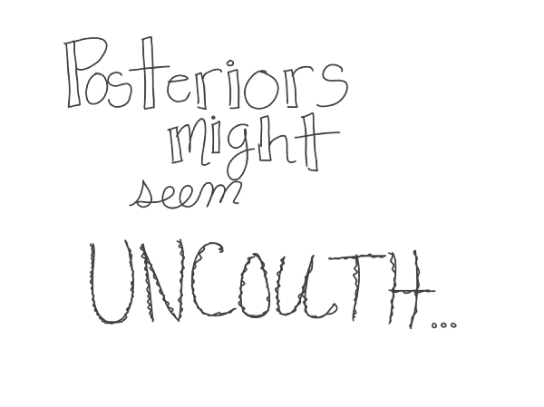

I write stuff.

## Computer Sciencey Stuff
[Huffman Coding](Huffman.html)
 
[Block Truncating Coding](BTC.html)
 
[Discrete Cosine Transform](DCT.html)
 
 

## Statsy Stuff
[Crash Course Statistics](https://www.youtube.com/playlist?list=PL8dPuuaLjXtNM_Y-bUAhblSAdWRnmBUcr)
 
[Accidental Chi-Square](AccidentialChiSq.html)
 
 

## Silly Stuff
 

 
[Everyone's a Little Bit Bayesian](https://medium.com/@chelseaparlett/everyones-a-little-bit-bayesian-f7f551cbe8af)
 
[An Ode to Neural Networs and Their Layers](https://medium.com/@chelseaparlett/one-layer-two-layer-1a2c70e594)
 
[A Limerick on p-values](https://medium.com/@chelseaparlett/a-limerick-on-p-values-46ac5208e073)
 
[#StatsAsCats](https://twitter.com/search?q=%23StatsAsCAts&src=typd)
 
 
